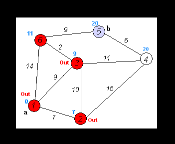
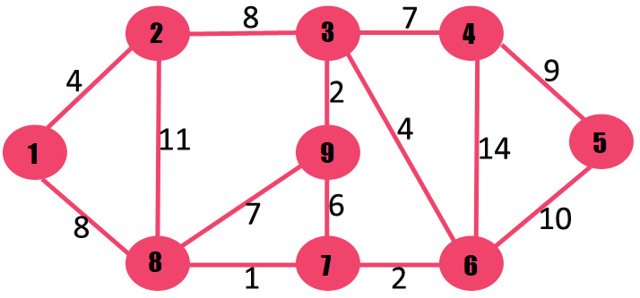
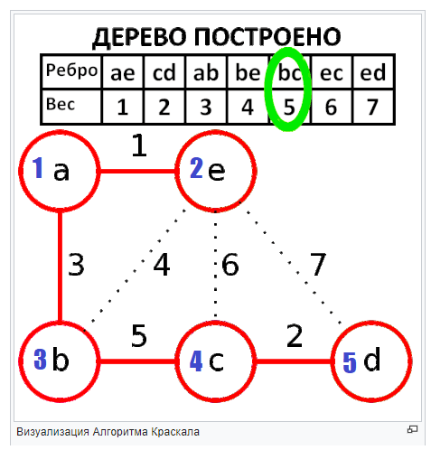
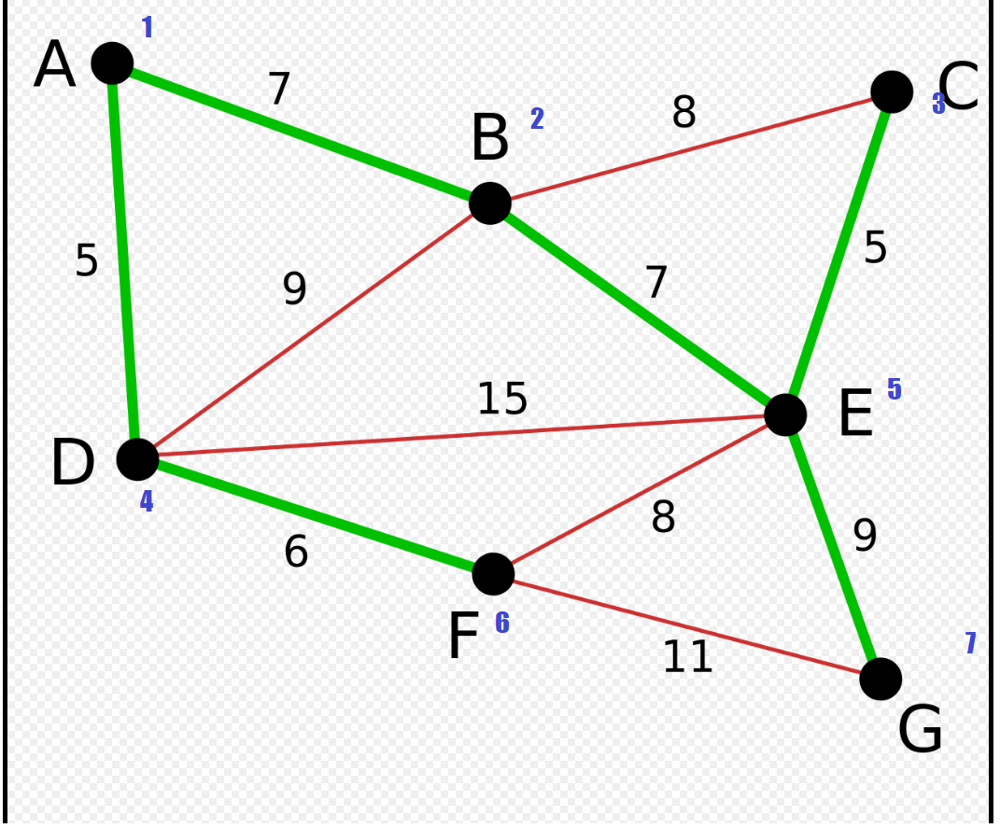

# Алгоритм Дейкстры (и бонусом Форд-Беллман for extra credit)

## Чо где лежит
В `dijkstra.cpp` реализации алгоритма Дейкстры и [Форда-Беллмана](https://e-maxx.ru/algo/ford_bellman) (легкий алгоритм, чтобы руками не проверять). Штуки с `_unor` воспринимают ребра как направленые в обе стороны.  В Дейкстре следующая вершина из которой будут происходить релаксации достается из очереди с приоритетом которая физически выглядит как `set<int,int> // d[i], i`. Реализацию с линейным поиском по `d[i]` не писал.

В `utils.cpp` класс `edge` и функция `reformat_graph`, которая превращает список ребер в список смежности (иначе пришлось бы сортировать ребра по вершине исхода и делать бинпоиск в Дейкстре и сложность была бы `O(n*log^2(m))`).

## Тесты из гугл-картинок

```
./trash/dij_input.txt:
0
6 9 1
1 2 7
1 6 14
1 3 9
6 3 2
2 3 10
6 5 9
2 4 15
3 4 11
5 4 6

output:
fb ans:
0 7 9 20 20 11 
dijkstra ans:
0 7 9 20 20 11 
paths:
path to 1: 1 
path to 2: 1 2 
path to 3: 1 3 
path to 4: 1 3 4 
path to 5: 1 3 6 5 
path to 6: 1 3 6
```



```
./trash/dij_input1.txt:
0
9 14 1
1 2 4
1 8 8
2 8 11
2 3 8
8 7 1
8 9 7
3 9 2
9 7 6
3 4 7
7 6 2
3 6 4
4 6 14
4 5 9
6 5 10

output:
fb ans:
0 4 12 19 21 11 9 8 14 
dijkstra ans:
0 4 12 19 21 11 9 8 14 
paths:
path to 1: 1 
path to 2: 1 2 
path to 3: 1 2 3 
path to 4: 1 2 3 4 
path to 5: 1 8 7 6 5 
path to 6: 1 8 7 6 
path to 7: 1 8 7 
path to 8: 1 8 
path to 9: 1 2 3 9 
```



# Алгоритм Крускалла

## Чо где лежит
В `kruskal.cpp` две реализации: `kruskal_array` -- медленная, деревья для вершин помечены в массиве, присоединение вершины к дереву работает за `O(n)`, и `kruskal_dsu` -- быстрая, деревья для вершин хранятся в [DSU](https://ru.algorithmica.org/cs/set-structures/dsu/) присоединение работает в среднем за `O(1)`.

В `utils.cpp` классы `edge` и `dsu`.

## Тесты из статьи в википедии
Синенькие цифры -- как я перенумеровал вершины для инпута.
```
krus_input.txt:
5 7 // кол-во вершин и ребер
1 2 1 // концы ребра и вес
1 3 3
2 3 4
3 4 5
2 4 6
2 5 7
4 5 2

output:
(1, 2, 1) (4, 5, 2) (1, 3, 3) (3, 4, 5) // ребра
```



```
krus_input1.txt:
7 11
1 2 7
2 3 8
1 4 5
2 4 9
2 5 7
3 5 5
4 5 15
4 6 6
5 6 8
5 7 9
6 7 11

output:
(1, 4, 5) (3, 5, 5) (4, 6, 6) (1, 2, 7) (2, 5, 7) (5, 7, 9)
```

