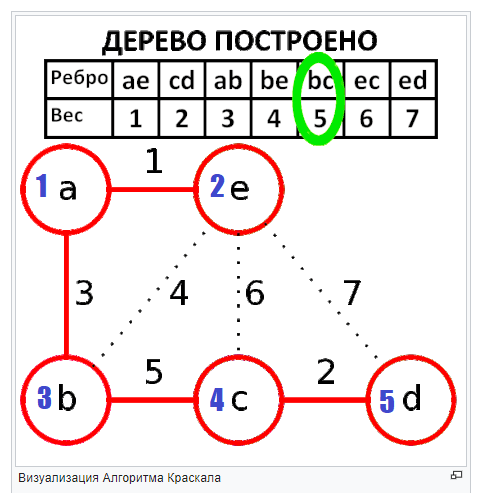
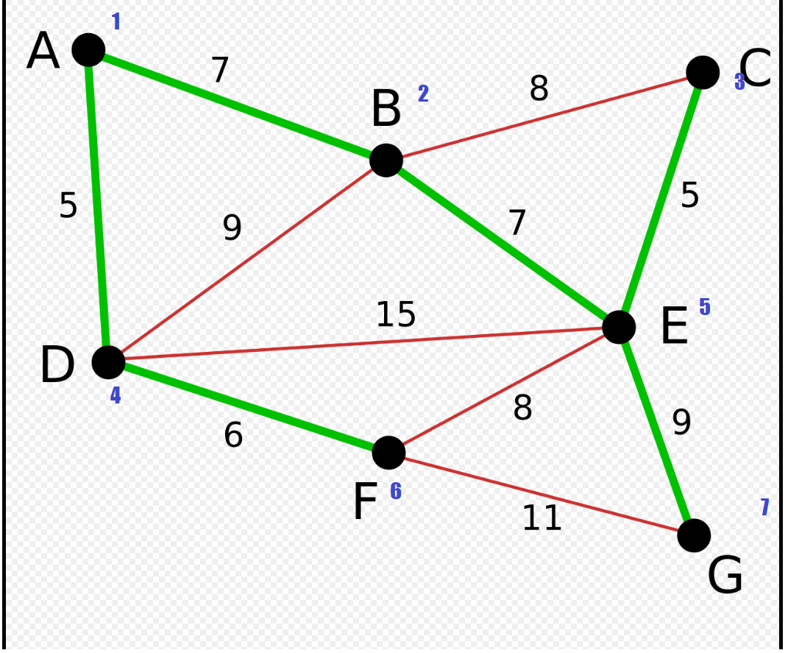

# Алгоритм Крускалла

## Чо где лежит
В `main.cpp` две реализации: `kruskal_array` -- медленная, деревья для вершин помечены в массиве, присоединение вершины к дереву работает за `O(n)`, и `kruskal_dsu` -- быстрая, деревья для вершин хранятся в [DSU](https://ru.algorithmica.org/cs/set-structures/dsu/) присоединение работает в среднем за `O(1)`.

В `utils.cpp` классы `edge` и `dsu`.

## Тесты из статьи в википедии
Синенькие цифры -- как я перенумеровал вершины для инпута.
```
input.txt:
5 7 // кол-во вершин и ребер
1 2 1 // концы ребра и вес
1 3 3
2 3 4
3 4 5
2 4 6
2 5 7
4 5 2

output:
(1, 2, 1) (4, 5, 2) (1, 3, 3) (3, 4, 5) // ребра
```



```
input1.txt:
7 11
1 2 7
2 3 8
1 4 5
2 4 9
2 5 7
3 5 5
4 5 15
4 6 6
5 6 8
5 7 9
6 7 11

output:
(1, 4, 5) (3, 5, 5) (4, 6, 6) (1, 2, 7) (2, 5, 7) (5, 7, 9)
```

